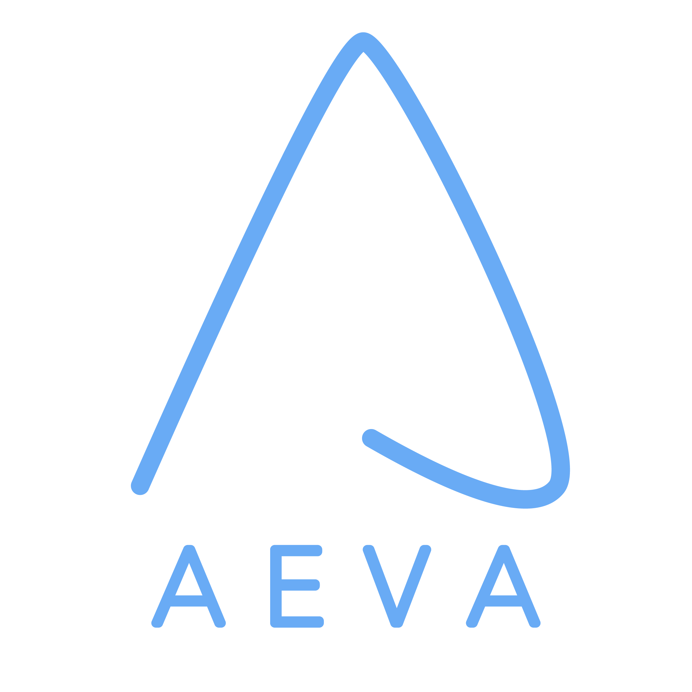

<div align="center">
  
  <h1>AevaScenes Python SDK</h1>
  <p><em>A Dataset and Benchmark for FMCW LiDAR Perception</em></p>
  <!-- Badges -->
  <p>
    
    =3.10-green?style=flat-square" alt="Python Versions">
    
    
  </p>
  <!-- Navigation Links -->
  <p>
    <a href="https://scenes.aeva.com/"><strong>Website</strong></a> |
    <a href="https://scenes.aeva.com/dataset"><strong>Dataset</strong></a> |
    <a href="https://scenes.aeva.com/download"><strong>Download</strong></a> |
    <a href="#license"><strong>License</strong></a> |
    <a href="#citation"><strong>Citation</strong></a>
  </p>
</div>

<!-- ## Overview -->

**AevaScenes** is a comprehensive multi-modal dataset designed to advance research in FMCW (Frequency-Modulated Continuous Wave) LiDAR perception. The dataset features synchronized data from **6 FMCW LiDARs** and **6 high-resolution cameras** mounted on a vehicle, captured across diverse urban and highway environments in the San Francisco Bay Area.

#### Instantaneous Velocity Measurements
AevaScenes features the longest-range FMCW LiDAR data ever released to the public, delivering over 400 meters of range with per-point velocity—enabling researchers and developers to explore perception capabilities beyond the limits of traditional datasets.

<p align="center">
  
</p>


#### Ultra-Long Range Detections
For the first time, FMCW LiDAR enables detections up to **400** meters by measuring instantaneous radial velocity per point directly at the sensor. Aeva's Doppler-based approach enhances long-range perception, enabling earlier detection of moving objects and improving overall safety for autonomous navigation.

<p align="center">
  
</p>


#### High Fidelity Perception Labels
AevaScenes provides annotations—including 3D bounding boxes, lane lines, and semantic segmentation—at ranges up to 400 meters. This unprecedented depth of annotation empowers research in long-range perception, planning, and tracking beyond the limits of existing datasets.

<p align="center">
  
</p>


#### High Dynamic Range Reflectivity
Unlike traditional LiDARs, FMCW LiDAR delivers high dynamic range with negligible blooming around retroreflective surfaces such as road signs, botts-dots and license plates, resulting in sharper object boundaries and more accurate perception, even in challenging high-reflectivity scenarios.

<p align="center">
  
</p>

#### Interactive Web Visualizer

A small subset of the highway/city/day/night sequences are available to see using the web visualizer here
**[AevaScenes Web Visualizer](https://scenes.aeva.com/visualize)**.

<p align="center">
  
</p>


## Download Dataset
1. Visit [scenes.aeva.com/downloads](https://scenes.aeva.com/downloads).
2. Register and agree to the license terms.
3. Download the dataset using the provided download script:

```bash
# If you were provided a single URL, please ensure to double quote the url, so it should look like "https://aeva-dataset-sequences.s3.us-west-1.amazonaws.com/..."
bash scripts/download_dataset.sh --url <URL> -o data/aevascenes_v0.1.tar.gz
cd data
tar -xvf aevascenes_v0.1.tar.gz

# If you were provided a file containing URL's
mkdir data/aevascenes_v0.1
bash scripts/download_dataset.sh --url-file signed_urls.txt --output data/aevascenes_v0.1
cd data/aevascenes_v0.1
for f in *.tar.gz; do tar -xvf "$f"; done
```

## Getting Started

Please see [Dataset.md](./docs/Dataset.md) for details about the dataset and schema.

Please see [Getting Started.md](./docs/Getting_Started.md) to get started with using the Python SDK. Here's a quick overview.

```bash
# Visualize a single sequence
python examples/visualize_aevascenes.py --dataroot <DATA_ROOT> --viz-mode sequence --sequence-uuid <UUID> --color-mode [velocity/reflectivity/semantic]

# Visualize a single sequence with points projected
python examples/visualize_aevascenes.py --dataroot <DATA_ROOT> --viz-mode sequence --sequence-uuid <UUID> --color-mode [velocity/reflectivity/semantic] --project-points

# Visualize random sampled frames from all sequences
python examples/visualize_aevascenes.py --dataroot <DATA_ROOT> --viz-mode sampled --color-mode [velocity/reflectivity/semantic] --project-points
```


## License

The AevaScenes dataset is provided under the **AevaScenes Dataset License Agreement** for non-commercial use only. The AevaScenes Python SDK is licensed under the MIT License.

- **Dataset License**: [AevaScenes Dataset License](https://scenes.aeva.com/license)
- **Code License**: [MIT License](LICENSE-CODE)


## Citation

If you use AevaScenes in your research, please cite our work using the following BibTeX.

```bibtex
@misc{aevascenes,
  title        = {AevaScenes: A Dataset and Benchmark for FMCW LiDAR Perception},
  author       = {Narasimhan, Gautham Narayan and Vhavle, Heethesh and Vishvanatha, Kumar Bhargav and Reuther, James},
  year         = {2025},
  url          = {https://scenes.aeva.com/},
}
```

## Contributing

We welcome contributions to improve the AevaScenes dataset and toolkit! Please see our contributing guidelines and submit pull requests for:

- Requests for data diversity.
- Bug fixes and performance improvements.
- New visualization features.
- Dataset utilities and analysis tools.

## Support

- **Website**: [scenes.aeva.com](https://scenes.aeva.com/)
- **Issues**: [GitHub Issues](https://github.com/aevainc/aevascenes/issues)
- **Email**: [research@aeva.ai](mailto:research@aeva.ai)
